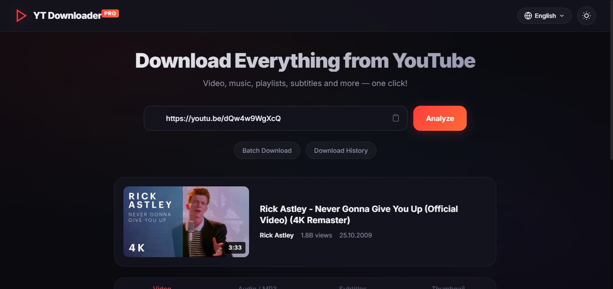

# 🎬 YouTube Downloader Pro

An advanced YouTube video, audio, playlist, and subtitle downloader application with a modern interface and robust backend. Built on Node.js, Express, Socket.io, and powered by yt-dlp/ffmpeg.

 <!-- You can add a screenshot of the project here -->

## 🌟 Features

* **🎥 Video Download:** Support for downloading videos in MP4 format at 4K, 2K, 1080p, 720p, and lower resolutions based on quality selection.
* **🎵 Advanced Audio Options:** Choose to download videos Normally (with Audio) or Video Only (Muted) for faster bandwidth usage.
* **🎧 Audio Extraction:** Lossless and high-quality audio downloads in MP3 (up to 320kbps), M4A, FLAC, WAV, OPUS, and OGG formats.
* **📜 Playlist Support:** Paste a playlist link to parse all videos, selectively tick what you want, and batch download them as either video or audio.
* **📦 Batch Download:** Paste multiple links line-by-line and queue all your videos sequentially.
* **✂️ Video Trimming:** Download only a specific time fragment (e.g., 01:20 - 03:45) processed efficiently on the server-side via FFmpeg.
* **📝 Subtitle and Thumbnail:** Retrieve the thumbnail (cover image) and subtitles (.srt) across all available languages.
* **⚡ Live Progress Tracking:** Real-time visual progress bars, download speeds, ETA (Estimated Time of Arrival), and percentages powered smoothly by Socket.io.
* **📁 Advanced Save to Folder:** Save completed batch files with a single click directly to a selected directory leveraging the File System Access API (with a seamless fallback mechanism for older browsers).
* **🌐 Multi-language Support:** English, Turkish, and easily expandable custom language options inside the interface.
* **🌗 Theme Support:** Modern Dark and Light theme toggle functionality.
* **🕒 Download History:** A built-in history menu that keeps records of your previously downloaded files for easy re-access.

## 🛠️ Requirements & Installation

### Requirements
To run this project, make sure you have the following software installed/available on your machine:

1. **[Node.js](https://nodejs.org/)** (v16 or higher is recommended)
2. **yt-dlp.exe**: Must be located in the project's root directory (same directory as `server.js`). The application uses this dependency in the background to fetch YouTube data and execute streams.
3. **ffmpeg.exe**: Must be located in the project's root directory. (Required for trimming videos and merging audio with video streams at high resolutions).

### Installation Steps

1. Clone the repository or download it as a ZIP file:
   ```bash
   git clone https://github.com/yourusername/youtube-downloader-pro.git
   cd youtube-downloader-pro
   ```

2. Install the necessary Node.js dependencies:
   ```bash
   npm install
   ```

3. Include the Required Dependencies:
   Paste the downloaded `yt-dlp.exe` and `ffmpeg.exe` binaries into the root directory of the project. (Optionally, add them to your Windows PATH environment variable).

4. Start the Server:
   ```bash
   npm start
   ```

5. Open your browser and navigate to:
   ```
   http://localhost:3000
   ```

## 💻 Tech Stack

- **Frontend:** HTML5, CSS3, Vanilla JavaScript (modern capabilities).
- **Backend:** Node.js, Express.js.
- **Real-time Communication:** Socket.io.
- **Download Engine:** [yt-dlp](https://github.com/yt-dlp/yt-dlp) and [FFmpeg](https://ffmpeg.org/).

## ⚠️ Legal Disclaimer

This tool is developed strictly for personal use, educational purposes, and for downloading copyright-free materials or content you have permission to download. Unauthorized downloading or distribution of copyrighted materials contrary to YouTube's Terms of Service is prohibited. The developer cannot be held responsible for any misuse of this application.

## 🤝 Contributing

Bug reports, feature requests, and Pull Requests are always welcome! If you'd like to contribute, please start a discussion by opening an issue or submit a PR directly.

1. Fork this project
2. Create your own branch (`git checkout -b feature/AmazingFeature`)
3. Commit your changes (`git commit -m 'Added an amazing feature'`)
4. Push to the branch (`git push origin feature/AmazingFeature`)
5. Open a Pull Request

## 📄 License

This project is licensed under the [MIT License](LICENSE). See the `LICENSE` file for more details.
